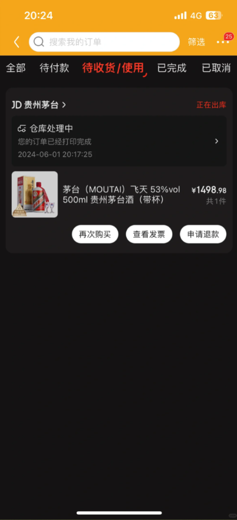

# 更新日期2024.06.04目前JD 的PC端无法使用，（只支持APP协议）
# 效果


~# 现在可以免费测试(--带star截图--联系我获取激活码)  
~当然！源码给钱也能出 哈哈哈
# 联系方式
邮箱 niudehua0927@outlook.com

### 暗中观察

根据 12 月 14 日以来抢茅台的日志分析，大胆推断再接再厉返回 Json 消息中`resultCode`与小白信用的关系。  
这里主要分析出现频率最高的`90016`和`90008`。

### 样例 JSON

```json
{'errorMessage': '很遗憾没有抢到，再接再厉哦。', 'orderId': 0, 'resultCode': 90016, 'skuId': 0, 'success': False}
{'errorMessage': '很遗憾没有抢到，再接再厉哦。', 'orderId': 0, 'resultCode': 90008, 'skuId': 0, 'success': False}
```

### 数据统计

| 案例 | 小白信用 | 90016  | 90008  | 抢到耗时 |
| ---- | -------- | ------ | ------ | -------- |
| 张三 | 63.8     | 59.63% | 40.37% | 暂未抢到 |
| 李四 | 92.9     | 72.05% | 27.94% | 4 天     |
| 王五 | 99.6     | 75.70% | 24.29% | 暂未抢到 |
| 赵六 | 103.4    | 91.02% | 8.9%   | 2 天     |

### 猜测

推测返回 90008 是京东的风控机制，代表这次请求直接失败，不参与抢购。  
小白信用越低越容易触发京东的风控。

从数据来看小白信用与风控的关系大概每十分为一个等级，所以赵六基本上没有被拦截，李四和王五的拦截几率相近，张三的拦截几率最高。

风控放行后才会进行抢购，这时候用的应该是水库计数模型，假设无法一次性拿到所有数据的情况下来尽量的做到抢购成功用户的均匀分布，这样就和概率相关了。

> 综上，张三想成功有点困难，小白信用是 100+的用户成功几率最大。


# 下载地址  
https://github.com/ord-kivy/JD_maotai_quick_buy/releases/tag/V7

# 有3位用户反馈6月1号抢到了
6月1放量 10000瓶 好几位用户反馈抢到 
都是晚上20点~~~ 笑哭


# 还有没有抢到的  邮件或wx反馈一下

